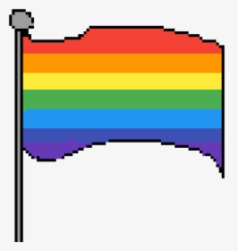

  

### Hey :vulcan_salute:

 

  

Hello everyone, nice to meet you. My name is Yeltsin Lima. I am a front-end developer who is currently learning back-end and also software development. I also trying to create some nice open-source things. Currently I'm working on a theme for my "company" (isn't really a company, because I'm the only one who works there, for now...) called [Crema](https://github.com/yeltsinxyz/crema). I'm also working on an application to help people with anxiety track they crisis based in the CBT therapy method. Since it's an app, I'm also learning Flutter :heart:.

### Some Personal Information

- 😜 Would like to try new stuff and anything interesting.
- 🌏 I am learning Chinese (Mandarin). I also know Portuguese (native), English (Advanced) and Spanish (basic to intermediate).
- 📚 I sometimes blog on Medium. You can [check out](https://link.yeltsin.xyz/medium)! But it's in portuguese.
- 🌈 I consider myself pansexual, support LGBTQ+, BlackLivesMatter, any moviment against opression and groups who support people who struggles with Anxiety and Depression.
- 💬 You can talk to me via [yeltsinxyz/issues](https://github.com/yeltsinxyz/yeltsinxyz/issues) or via [Telegram](https://t.me/yeltsinxyz)?
- 📫 If you really want to send me an e-mail: `hey@yeltsin.xyz`, or `yeltsin.s.lima@gmail.com` as a fallback.
- 🎧 Some of my playlist on Spotify: [Mood](https://open.spotify.com/playlist/5PT6aeCkGd5aEctdvVcPzt?si=YTUdso2nRFeOJvMMtlgNYw), [Sad Moood](https://open.spotify.com/playlist/2zWQl5EMcX7x3MWZLSJh3C?si=a3p5qzjpSxqaxaURQeSN1Q), [Love Mood](https://open.spotify.com/playlist/3wDhiq7jM82WG0ZS8zfI0o?si=BLe_YnX4TseAXyDGVZWcBA) and there is also an [Asia](https://open.spotify.com/playlist/1UvKFU7FVn2RvdH35ATAPx?si=c9pNz4sFR3Wop5wjG-Z7NA) playlist.
- 🙏 I am a bad buddhist (I really fail to follow the buddhism as it should)

### Fun? Facts

- ❤️ Sometimes I write to prisoners, mostly LGBTQ+ prisioners. If it's hard for us, imagine for them. I know they commited errors, but everyone does. You can [write too](https://writeaprisoner.com).
- 🧡 I have Depression, Anxiety and some Phobias. Currently my phobias are: medicine, airplanes, elevators.
- 💛 I accept everyone. Well, almost everyone. I have problems with people who are very radical (both left and right).
- 💚 I want to do Master Degree in China. Mostly because they are leading in AI, but also to understand more about the chinese culture.
- 💙 I lost some people to depression. If you need someone to talk, even anonymously, feel free to chat with me.
- 💜 I'm addicted to the color purple.
- 🤎 **TV Shows**: Doctor Who, Star Trek, Sherlock (Elementary too), Chinese/Korean Dramas. **Music**: Almost anything, really.
- 🤍 **Games**: Overwatch, 7 days to die (but I am really afraid of zombies so?!?!), No Man's Sky, Warframe. Check out my [Steam](https://steamcommunity.com/id/yeltsinxyz).
- 💘 I love making friends, feel free to follow me or chat with me.

### Credits

- README "inspiration": [BigCoke233](https://github.com/BigCoke233)
- Icons: [Iconscout](https://iconscout.com/unicons/)

---

You can see all the projects I'm currently working on down below, check them out and star if you like.
**Have a nice day~**
